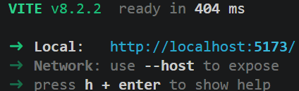
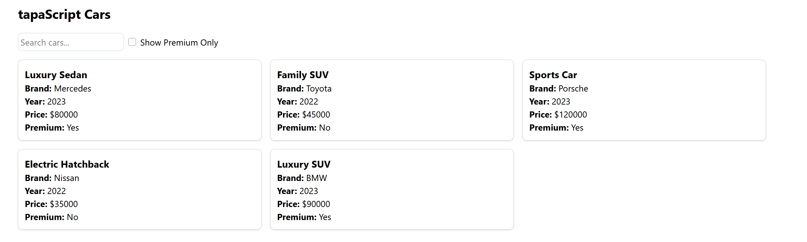
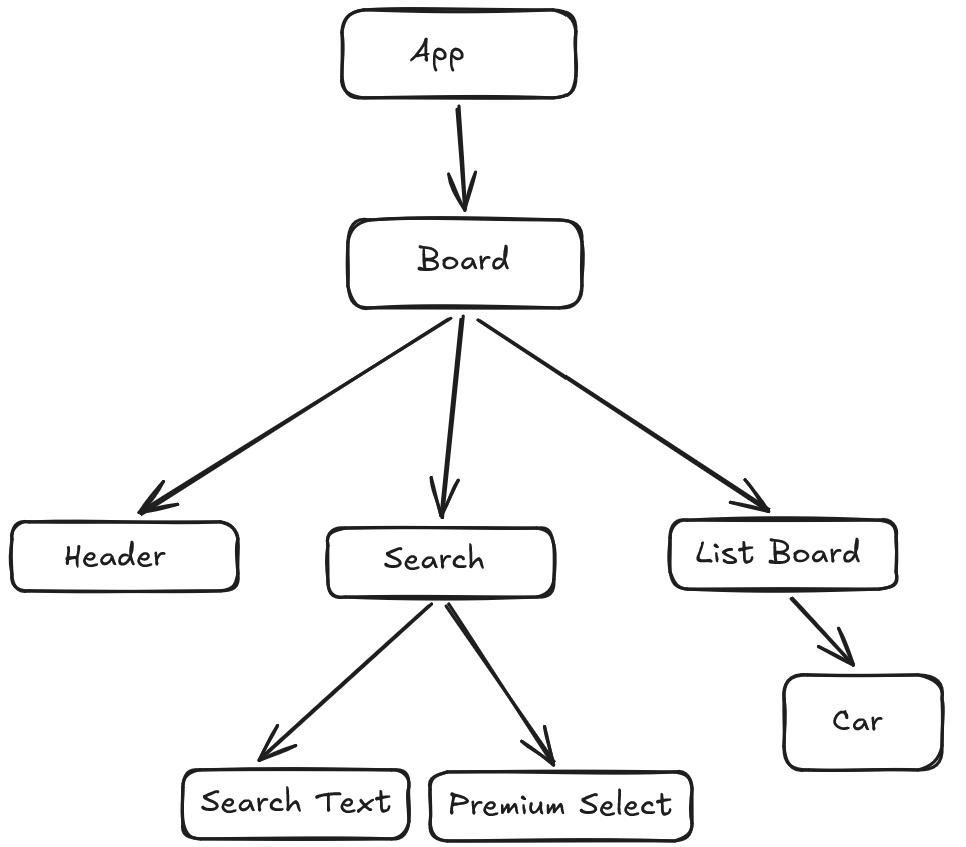
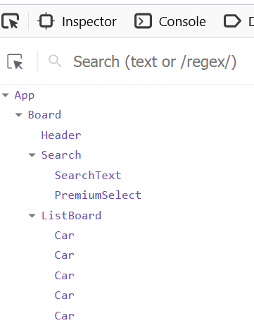

# tapaScript Cars (Task from video 3)

This project serves to display a web interface showing a list of cars along with some details about them in "cards" as shown in the diagram.

## How to run it
- Clone this repository.
- Navigate to the folder containing the "package.json" file.
- Run "npm install" or "bun install". This will install all the dependencies.
- After the installation is complete, run "bun dev" or "npm start" to start the app. It will provide a URL looking like this:

- Go to the given URL in a browser and Voila! your app is up and running.

## UX Design of the app

## Component Breakdown Diagram

## React Dev Tools Screenshot
